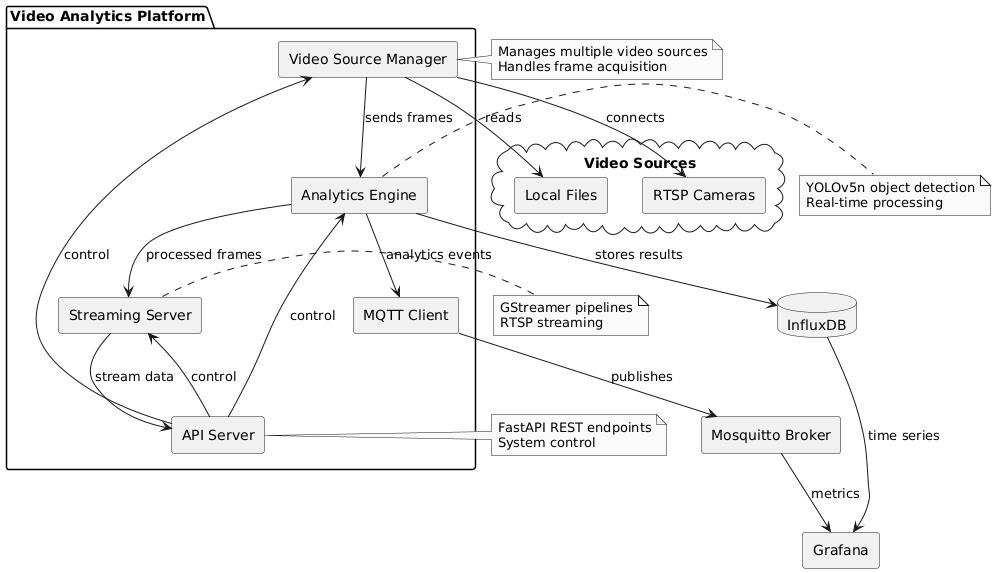

# Multi-Source Video Analytics & Streaming Platform

A real-time video analytics and streaming platform that aggregates feeds from multiple sources, applies AI-powered analytics, and streams both raw and annotated video to clients.

## Features

- **Multi-Source Video Ingestion**: Aggregate feeds from webcams, IP cameras, and RTSP streams
- **AI-Powered Analytics**: Apply object detection, motion tracking, and heatmap generation
- **Real-Time Streaming**: Distribute raw and annotated video streams via RTSP and HLS
- **REST API**: Control and monitor the platform programmatically
- **MQTT Integration**: Real-time messaging for events and control
- **Client Applications**: View streams and analytics in desktop or web clients
- **Time Series Database**: Store analytics data for historical analysis (optional)
- **Containerized Deployment**: Easy deployment with Docker and Docker Compose

## System Architecture



The platform consists of several modular components:

1. **Video Ingestion Layer**: Captures video from multiple sources using GStreamer
2. **Analytics Engine**: Processes frames with OpenCV and ML models for object detection
3. **Streaming Server**: Distributes video streams via RTSP and HLS
4. **API Server**: Provides REST endpoints for control and monitoring
5. **MQTT Client**: Handles real-time messaging for events and control (optional)
6. **Database Integration**: Stores analytics data in InfluxDB (optional)
7. **Client Applications**: Desktop and web interfaces for viewing streams

## Quick Start

### Option 1: Install Locally

```bash
# Clone the repository
git clone https://github.com/yourusername/video-analytics-platform.git
cd video-analytics-platform

# Install dependencies and setup
python setup_project.py

# Start the platform
python main.py
```

### Option 2: Using Docker

```bash
# Build and run with Docker Compose
docker-compose up
```

## Accessing the Platform

- **API and Documentation**: http://localhost:8000/docs
- **Web Client**: http://localhost:8000/ or open client/web_client.html
- **RTSP Streams**: rtsp://localhost:8554/streams
- **HLS Streams**: http://localhost:8080/stream

## System Requirements

- **Python**: 3.8+
- **GStreamer**: 1.18+ with plugins
- **OpenCV**: 4.5+
- **NVIDIA GPU**: Recommended for faster ML processing (optional)

## Documentation

- [Setup Instructions](docs/SETUP.md)
- [Usage Guide](docs/USAGE.md)
- [API Documentation](docs/API.md)
- [Architecture](docs/ARCHITECTURE.md)

## License

MIT License 